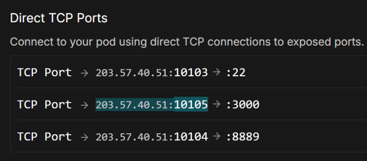

ComfyStream is available as a custom node through the [ComfyUI Manager](https://registry.comfy.org/nodes/comfystream) or as a Docker image. Follow the method that best suits your setup.

<Tip>
You can also install Comfystream by cloning the repository into your ComfyUI/custom_nodes folder — see [Manual Installation](/technical/get-started/install#manual-installation-cloning-repository) for details.
</Tip>

<CardGroup cols={2}>
  <Card
    title="ComfyUI Manager (Recommended)"
    icon="plug"
    href="#install-with-comfyui-manager"
  >
    Install ComfyStream directly into an existing ComfyUI setup.
  </Card>
  <Card title="Docker (Self-contained)" icon="box" href="#install-with-docker">
    Run ComfyStream and ComfyUI together in a prebuilt Docker container.
  </Card>
</CardGroup>

---

## Install with ComfyUI Manager

If you already have ComfyUI installed, the easiest way to install ComfyStream is via the built-in **ComfyUI Manager**.

<Steps>
  <Step title="Install ComfyUI (if needed)">
    Download and install [ComfyUI](https://github.com/hiddenswitch/ComfyUI?tab=readme-ov-file#installing) if you haven't already.
    <Note>
      Currently **comfystream** works only with the [hiddenswitch
      fork](https://github.com/hiddenswitch/ComfyUI) of ComfyUI, the team is
      actively working add full support for [official
      ComfyUI](https://github.com/comfyanonymous/ComfyUI).
    </Note>
    <Note>
      ComfyUI must be run with frontend version `v1.24.2` or older. You can do this by launching ComfyUI with the flag `--front-end-version Comfy-Org/ComfyUI_frontend@v1.24.2`
    </Note>
  </Step>
  <Step title="Install ComfyUI Manager (if needed)">
    Follow the [ComfyUI Manager installation guide](https://docs.comfy.org/essentials/core-concepts/nodes#installing-the-manager) if you haven't already.
  </Step>
  <Step title="Install ComfyStream via Manager">
    1. Launch **ComfyUI**.
    2. Open the **Manager** tab.
    3. Search for **ComfyStream** and click **Install**.
  </Step>
  <Step title="Restart ComfyUI">
    Restart your ComfyUI server to load the new custom node.
  </Step>

</Steps>

{/* <!-- prettier-ignore-start --> */}

## Manual Installation

If you prefer more control over the installation process, you can install ComfyStream manually using one of the following methods:
<Note>
  Python 3.12 or greater is required
</Note>
<Accordion title="Install ComfyStream via comfy-cli">
The following commands install the latest version of ComfyUI and ComfyStream
  ```bash
  pip install comfy-cli
  comfy install
  comfy node registry-install comfystream
  ```
  After completing the installation, start ComfyUI with the following command
  ```bash
  comfy launch -- --listen 0.0.0.0 --port 8188 --front-end-version Comfy-Org/ComfyUI_frontend@v1.24.2
  ```
  This will start the ComfyUI server with ComfyStream installed.
</Accordion>

<Accordion title="Cloning Repository">
  If you prefer to install ComfyStream manually by cloning the repository instead of using the Manager, follow these steps:
  ```bash
  git clone https://github.com/comfyanonymous/ComfyUI
  cd ComfyUI
  pip -r requirements.txt
  cd custom_nodes
  git clone https://github.com/livepeer/comfystream.git
  cd comfystream
  python install.py
  ```
  After completing the installation, navigate to the root of the ComfyUI directory.
  ```bash
  cd ComfyUI
  python main.py --listen --front-end-version Comfy-Org/ComfyUI_frontend@v1.24.2
  ```
  This will start the ComfyUI server with ComfyStream installed.
</Accordion>
{/* <!-- prettier-ignore-end --> */}

---

## Install with Docker

Run ComfyStream in a prebuilt Docker environment, either on your own GPU or a cloud server.

<CardGroup cols={2}>
  <Card title="Local GPU" icon="desktop" href="#local-gpu">
    Run ComfyStream locally with your own GPU.
  </Card>
  <Card title="Remote GPU" icon="cloud" href="#remote-gpu">
    Deploy ComfyStream on a remote GPU using RunPod or Ansible.
  </Card>
</CardGroup>

### Local GPU

If you have a compatible GPU on Windows or Linux, you can run ComfyStream locally via Docker.

#### Prerequisites

First, install the required system software:

<AccordionGroup>
  <Accordion title="Linux">
    - [Docker
    Engine](https://docs.docker.com/engine/install/ubuntu/#install-using-the-repository)
    - [NVIDIA CUDA
    Toolkit](https://developer.nvidia.com/cuda-12-8-1-download-archive?target_os=Linux&target_arch=x86_64&Distribution=Ubuntu&target_version=24.04&target_type=runfile_local)
    - [NVIDIA Container
    Toolkit](https://docs.nvidia.com/datacenter/cloud-native/container-toolkit/latest/install-guide.html)
  </Accordion>
  <Accordion title="Windows">
    <Steps>
      <Step title="Install WSL 2">
        - From a new command prompt, run: `wsl --install` - Update WSL if
        needed: `wsl.exe --update`
      </Step>
      <Step title="Launch Ubuntu in Terminal">
        Open a new **Ubuntu (WSL)** tab from Terminal.
      </Step>
      <Step title="Install NVIDIA CUDA Toolkit">
        Inside of WSL, install [NVIDIA CUDA
        Toolkit](https://developer.nvidia.com/cuda-12-8-1-download-archive?target_os=Linux&target_arch=x86_64&Distribution=WSL-Ubuntu&target_version=2.0&target_type=runfile_local)
      </Step>
      <Step title="Install Docker Desktop">
        Install [Docker
        Desktop](https://docs.docker.com/get-started/introduction/get-docker-desktop/).
      </Step>
      <Step title="Enable WSL 2 Engine in Docker">
        Ensure Docker Desktop is set to use the WSL 2 Engine in settings.
      </Step>
      <Step title="Verify Docker Access">
        Inside WSL: `docker ps` should return a result.
      </Step>
      <Step title="Continue with setup">
        Proceed with the next steps in your WSL terminal.
      </Step>
    </Steps>
  </Accordion>
</AccordionGroup>

#### Run the Docker Container

<Steps>
  <Step title="Create model and output directories">
    These folders store your models and generated outputs. Docker mounts them into the container.

    <CodeGroup>
      ```bash Linux
      mkdir -p ~/models/ComfyUI--models ~/models/ComfyUI--output
      ```
      ```batch Command Line
      mkdir %USERPROFILE%\models\ComfyUI--models %USERPROFILE%\models\ComfyUI--output
      ```
      ```powershell PowerShell
      New-Item -ItemType Directory -Path "$env:USERPROFILE\models\ComfyUI--models", "$env:USERPROFILE\models\ComfyUI--output"
      ```
    </CodeGroup>

  </Step>
  <Step title="Pull the ComfyStream container">
    ```bash
    docker pull livepeer/comfystream:stable
    ```
    <Info>
      If using Windows, ensure Docker Desktop is running first.
    </Info>
  </Step>
  <Step title="Run the container">
    ```bash
    docker run -it --gpus all \
      -p 8188:8188 \
      -p 8889:8889 \
      -p 5678:5678 \
      -p 3000:3000 \
      -v ~/models/ComfyUI--models:/workspace/ComfyUI/models \
      -v ~/models/ComfyUI--output:/workspace/ComfyUI/output \
      livepeer/comfystream:stable --download-models --build-engines --server
    ```
    <Note>
      Available flags:
      - `--download-models` downloads some default models  
      - `--build-engines` optimizes the runtime for your GPU  
      - `--server` starts ComfyUI server (accessible on port 8188)
      - `--api` enables the API server
      - `--ui` starts the ComfyStream UI (accessible on port 3000)
      - `--use-volume` should be used with a mount point at /app/storage. It is used during startup to save/load models and compiled engines to a host volume mount for persistence
      
      The `--download-models` and `--build-engines` flags are only needed the first time (or when adding new models).
    </Note>
  </Step>
  <Step title="Access ComfyUI">
    Open your browser and go to [http://localhost:8188](http://localhost:8188) to start using ComfyUI with ComfyStream.
  </Step>
  <Step title="Access ComfyStream UI">
    The ComfyStream UI is available at [http://localhost:3000](http://localhost:3000) where you can start live streams directly by keeping the stream URL as `http://localhost:8889` and selecting a workflow.
    
    
  </Step>
</Steps>

### Remote GPU

If you don't have a local GPU, you can run ComfyStream on a cloud server. Choose between a managed deployment with **RunPod** or manual setup using **Ansible**.

#### Run with RunPod

RunPod provides a simple one-click deployment of ComfyStream in a managed container environment — perfect for testing or avoiding manual setup.

<Steps>
  <Step title="Launch the RunPod template">
    Use this template to get started:
    [livepeer-comfystream](https://console.runpod.io/deploy?template=w01m180vxx&ref=u8tlskew)
    <Note>
      RunPod does not persist pod data by default. To ensure models and engines persist across pod restarts, use the RunPod template [livepeer-comfystream-volume](https://console.runpod.io/deploy?template=j4p1g7t5vs&ref=u8tlskew)

      This template uses the `--use-volume` flag to save all models and engines to the mount path `/app/storage`. A network volume is required.
    </Note>

  </Step>
  <Step title="Create a network volume">
    When using the persistent template, create and attach a network volume.
    
  </Step>
  <Step title="Choose your GPU and deploy">
    Select a suitable GPU (e.g. RTX 4090), then click **Deploy On-Demand**.
  </Step>
  <Step title="Monitor deployment">
    Use the **Logs** button to watch the container spin up.
    
  </Step>
  <Step title="Access ComfyUI">
    Once running, click **Connect** from the pod dashboard.
    
  </Step>
  <Step title="Open ComfyUI">
    Click the **HTTP Service → :8188** link. It will open in a new browser tab.
  </Step>
  <Step title="Access ComfyStream UI">
    To access the ComfyStream UI, use the TCP ports to form a URL beginning with `https://` followed by the IP:port for port 3000. 
    
    You can start a live stream directly from the ComfyStream UI by keeping the stream URL as `http://localhost:8889` and selecting a workflow.
    
    
  </Step>
</Steps>

#### Deploy with Ansible

Use [Ansible](https://docs.ansible.com/ansible/latest/playbook_guide/playbooks_intro.html) to deploy ComfyStream to your own cloud VM (like AWS, GCP, Azure, or TensorDock). Great if you want more control or a repeatable, fully automated setup.

<Steps>
  <Step title="Create a cloud VM">
    Provision a VM with at least:
    - **GPU**: 20GB VRAM  
    - **RAM**: 16GB  
    - **CPU**: 4 vCPUs  
    - **Disk**: 100GB  
  </Step>
  <Step title="Open required ports">
    Allow incoming traffic on:
    - **22** (SSH – internal port)
    - **8189** (ComfyStream HTTPS – internal port)
    <Note>
      Ensure your cloud provider maps these to **public ports**. Internal port **8189** is proxied to **8188**, which serves the ComfyUI interface.
    </Note>
  </Step>
  <Step title="Install Ansible">
    Install Ansible on your **local machine** (not the VM). See the [official installation guide](https://docs.ansible.com/ansible/latest/installation_guide/index.html).
  </Step>
  <Step title="Clone the ComfyStream playbook">
    ```bash
    git clone https://github.com/livepeer/comfystream.git
    cd comfystream/scripts/ansible
    ```
    <Info>
      No need to install anything on the VM — Ansible sets it all up over SSH.
    </Info>
  </Step>
  <Step title="Add your VM IP to the inventory">
    Open `inventory.yml` and add your VM's public IP address.
  </Step>
  <Step title="Set a custom password (optional)">
    Edit the `comfyui_password` value in `plays/setup_comfystream.yaml`.
    <Note>
      This sets the password used to access ComfyUI in your browser.
    </Note>
  </Step>
  <Step title="Run the playbook">
    ```bash
    ansible-playbook -i inventory.yaml plays/setup_comfystream.yaml
    ```
    <Info>
      If you're not using a root user, add `--ask-become-pass` to enter your sudo password.
    </Info>
    <Note>
      The playbook pulls a ~20GB Docker image on the VM. This may take a while on first run.
    </Note>
  </Step>
  <Step title="Monitor download progress (optional)">
    If needed, SSH into the VM and run:
    ```bash
    docker pull livepeer/comfystream:stable
    ```
    <Info>
      Helpful if you're unsure whether the download is progressing during first-time setup.
    </Info>
  </Step>
  <Step title="Open ComfyUI">
    Visit `https://<VM_IP>:<PUBLIC_COMFYUI_PORT>` in your browser.
  </Step>
</Steps>

---

## Accessing ComfyStream

1. Click the **ComfyStream** menu button in ComfyUI:

   <Frame>
     
   </Frame>

2. Open **Server Settings** to verify that ComfyStream is configured to bind to the correct interface and port.

   <Note>For remote environments like RunPod, set the Host to `0.0.0.0`.</Note>
   <Frame>
     
   </Frame>

3. Click **Save** to apply the settings.

4. Open the **ComfyStream** menu again and click **Start ComfyStream Server**. Wait for the server status indicator to turn green.

   <Note>
     You can monitor ComfyStream server logs in the ComfyUI log terminal tab.
   </Note>

5. Click **Open ComfyStream UI** to launch it in a new tab. Alternatively, double-click the node graph and search for **ComfyStream UI Preview**.
   <Frame>
     
   </Frame>

## Troubleshooting

<AccordionGroup>
  <Accordion title="Docker Hub Rate Limits (toomanyrequests error)">
  
    <Note>
      If you encounter a `toomanyrequests` error while pulling the Docker image, either
      wait a few minutes or provide your Docker credentials when running the playbook:

      ```bash
      ansible-playbook -i inventory.yaml plays/setup_comfystream.yaml -e "docker_hub_username=your_dockerhub_username docker_hub_password=your_dockerhub_pat"
      ```
    </Note>

  </Accordion>
</AccordionGroup>
